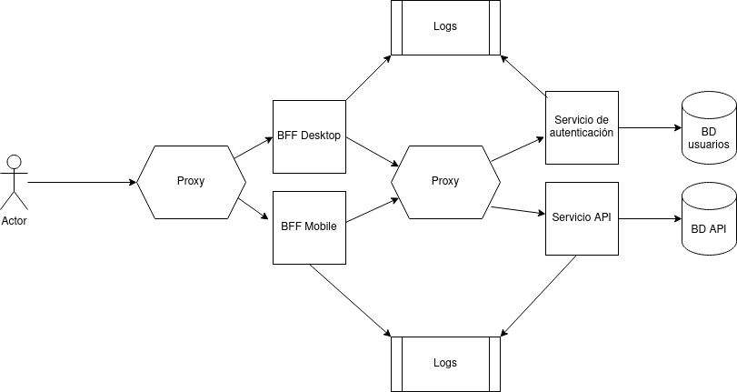

# Evaluacion 2

Como segunda evaluación, se ha de realizar una API compuesta de varios servicios distribuidos.

La API como tal va a exponer una entidad de su preferencia, idealmente algo sencillo, puede ser una API de perros, gatos, paises, marcas... queda a decisión de ustedes de que va a tratar la API.

Para esta evaluacion, deben familiarizarse con el concepto de BFFs https://samnewman.io/patterns/architectural/bff/ .

El diagrama de los servicios a realizar:

El punto de entrada a la API va a ser un proxy, este proxy sirve a dos BFFs, uno para aplicaciones móviles y otro para aplicaciones desktop. El proxy va a redirigir a un BFF en particular dependiendo del path de la petición.

Por ejemplo, si al proxy le llega una peticion que dice que es para `http://<HOST>/destkop/...`, entonces la redirigira al BFF Desktop, si es para `http://<HOST>/mobile/...` entonces la redirigirá al BFF mobile. 

Luego, los BFFs están encargados de realizar peticiones a los servicios backend como tal, a través de otro proxy configurado similarmente al anterior, el cual igualmente va a redirigir la petición en base al path en el URL de la petición.

Tienen que haber dos servicios, un servicio de autenticación que se encarga de proveer a usuarios la capacidad de registrarse y de poder validar sus credenciales, y un servicio de API como tal que expone la entidad definida por ustedes.

Hay dos tipos de usuarios, administrador y lector, un administrador puede hacer las 4 operaciones CRUD sobre cualquier objeto almacenado, mientras que un lector solo puede leer.

El servicio de autenticación, como se ha mencionado, expone funcionalidad para permitir a un usuario registrarse como un usuario lector y luego autenticarse, devolviendo algo para demostrar su identidad (esto puede ser un JWT, una cookie, etc, eso es un detalle de implementación).

El servicio de API, al recibir una petición, debe validar que el usuario es válido y que además tiene permisos para realizar la operación que decide hacer.

Todos los servicios (los BFF y los dos servicios principales) deben mandar sus logs a un acumulador de logs (puede usar el stack ELK visto en clase u otro de su preferencia).

Todos los servicios (los BFF y los dos servicios principales) deben estar contenedorizados. 

Cada servicio tiene su propia base de datos para almacenar sus datos.